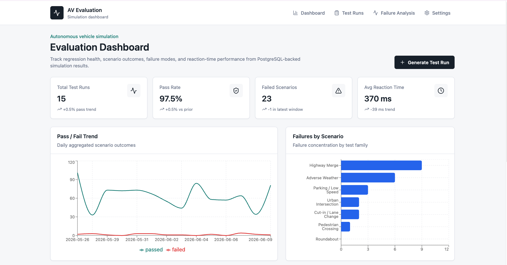
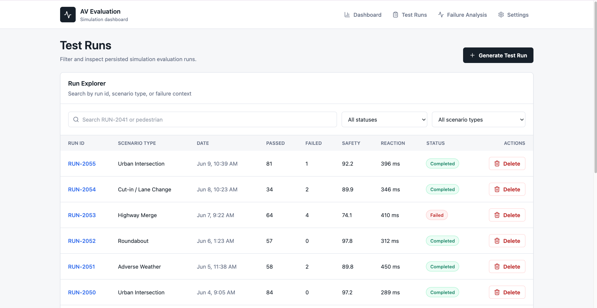
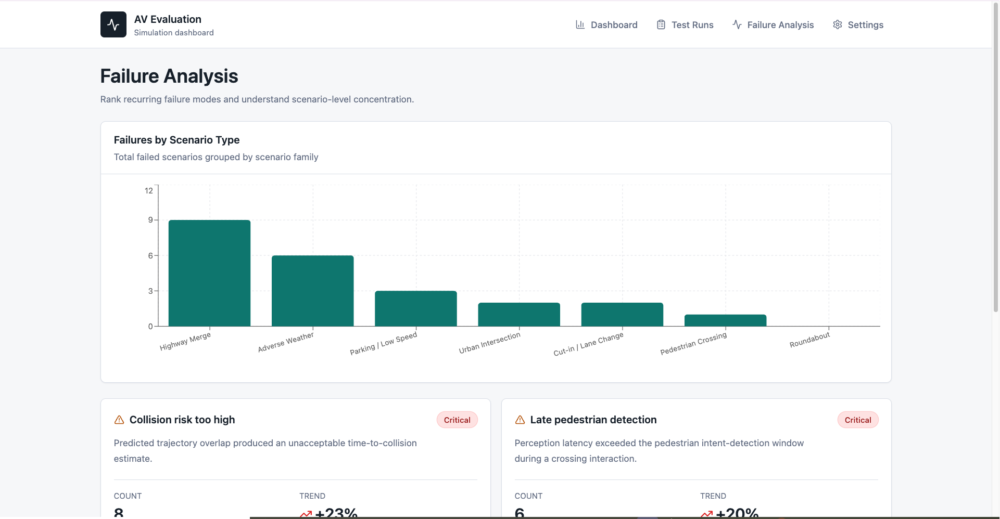
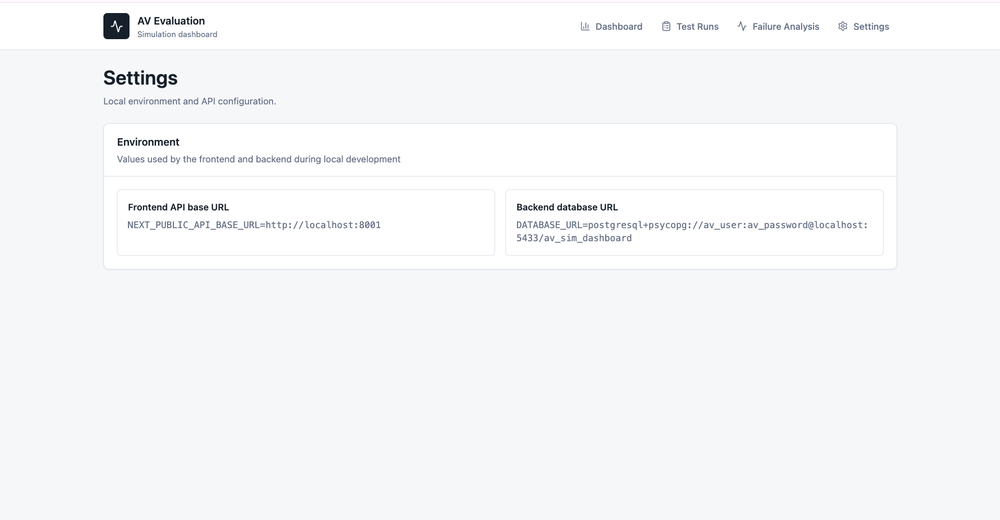

# Autonomous Vehicle Simulation Evaluation Dashboard

A full-stack portfolio project for reviewing autonomous vehicle and ADAS simulation evaluation results. The application combines a Next.js frontend, FastAPI backend, PostgreSQL database, and interactive data visualizations to simulate how autonomous vehicle teams analyze regression testing results.

## Live Links

- Live App: https://av-simulation-dashboard-production.up.railway.app
- Backend API Health Check: https://resourceful-determination-production-1f7b.up.railway.app/health
- Backend API Example: https://resourceful-determination-production-1f7b.up.railway.app/api/metrics/summary

## Screenshots

### Dashboard



### Test Runs



### Failure Analysis



### Settings



## What I Built

- Designed a multi-page autonomous vehicle simulation dashboard
- Built a FastAPI backend with REST API endpoints
- Integrated PostgreSQL persistence using SQLAlchemy
- Created seeded simulation datasets covering multiple driving scenarios
- Implemented filtering, search, and run inspection workflows
- Added synthetic test run generation for dynamic data creation
- Built interactive charts using Recharts
- Implemented run deletion and database updates through the API
- Connected frontend and backend through typed API clients

## Why This Exists

Simulation teams need a compact way to inspect whether regression runs are getting safer or riskier across scenario families. This project models that workflow with seeded AV evaluation data, detailed run pages, failure analysis, charting, and API-driven test run management.

## Tech Stack

- Next.js App Router
- React
- TypeScript
- Tailwind CSS
- Recharts
- FastAPI
- Python
- SQLAlchemy 2.0
- Pydantic
- PostgreSQL
- Docker Compose

## Features

- Dashboard summary metrics
- Pass/fail trend visualizations
- Failure concentration analysis
- Test run explorer with filtering and search
- Detailed simulation run pages
- Failure reason tracking
- Generate synthetic test runs
- Delete test runs
- PostgreSQL-backed persistence
- Automatic database seeding

## Architecture

```text
Next.js Frontend
        |
        v
    FastAPI API
        |
        v
SQLAlchemy Models
        |
        v
   PostgreSQL
```

The frontend reads `NEXT_PUBLIC_API_BASE_URL`, which defaults to `http://localhost:8001`.

The backend reads `DATABASE_URL`, defaults to PostgreSQL running on `localhost:5433`, creates tables on startup, and seeds the database when empty.

## Local Setup

### 1. Copy frontend environment variables

```bash
cp .env.example .env.local
```

### 2. Start PostgreSQL

```bash
docker compose up -d
```

### 3. Install and run the backend

```bash
cd backend

python3 -m venv .venv
source .venv/bin/activate

pip install -r requirements.txt

cp .env.example .env

uvicorn app.main:app --reload --port 8001
```

API:

```text
http://localhost:8001
```

### 4. Install and run the frontend

```bash
pnpm install
pnpm dev
```

Application:

```text
http://localhost:3000
```

## Backend Commands

Run API:

```bash
cd backend
source .venv/bin/activate
uvicorn app.main:app --reload --port 8001
```

Reseed database:

```bash
cd backend
source .venv/bin/activate
python -m app.seed
```

Health check:

```bash
curl http://localhost:8001/health
```

## API Routes

| Method | Route                            |
| ------ | -------------------------------- |
| GET    | /health                          |
| GET    | /api/metrics/summary             |
| GET    | /api/runs                        |
| GET    | /api/runs/{run_id}               |
| POST   | /api/runs/generate               |
| DELETE | /api/runs/{run_id}               |
| GET    | /api/failures                    |
| GET    | /api/charts/pass-fail-trend      |
| GET    | /api/charts/failures-by-scenario |

## Database Tables

- test_runs
- scenario_details
- evaluation_events
- metric_rows
- review_notes
- failure_reasons

The API response models mirror the TypeScript types used by the frontend to keep data handling predictable and strongly typed.
